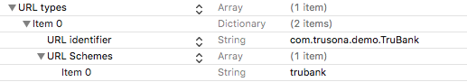

# Trusona SDK

The TrusonaSDK library allows simplified interaction with the Trusona API.

## Table of Contents

1. [Prerequisites](#prerequisites)
   1. [Artifactory username and password](#artifactory-username-and-password)
   1. [iOS SDK API Credentials](#ios-sdk-api-credentials)
      1. [Using a JWT token for API credentials](#using-a-jwt-token-for-api-credentials)
2. [CocoaPods Artifactory Setup](#cocoapods-artifactory-setup)
   1. [Installing the `cocoapods-art` plugin](#installing-the-cocoapods-art-plugin)
   1. [Adding your credentials to `.netrc`](#adding-your-credentials-to-netrc)
   1. [Adding the Trusona Artifactory pod specs repo](#adding-the-trusona-artifactory-pod-specs-repo)
3. [Integrating the API into a project](#integrating-the-api-into-a-project)
   1. [Integrate CocoaPods](#integrate-cocoapods)
   2. [Creating a Trusona Instance](#creating-a-trusona-instance)
   1. [Get the device identifier](#device-identifier)
4. [Handling Trusonafications](#handling-trusonafications)
5. [Scanning TruCodes](#scanning-trucodes)
6. [Handle Deep Links](#handle-deep-links)
7. [Scanning Driver's Licenses](#scanning-drivers-licenses)
8. [Upgrading to Executive](#upgrading-to-executive)
9. [Customizing the UI](#customizing-the-ui)


## Prerequisites

### Artifactory username and password

Trusona uses Artifactory to distribute artifacts associated with the Trusona mobile and server SDKs.

When Trusona provisions a developer account, we will create a new user in Artifactory and supply you with a username and password that you will use later on in this guide.

### iOS SDK API Credentials

The iOS SDKs require API credentials that are used by the SDK to identify and authenticate requests from your application to the Trusona APIs.

The two credentials required by the SDKs include a `token` and `secret`. Both are strings generated and distributed by Trusona.

### iOS Version
The Trusona SDK requires iOS 10.0 or higher.

## CocoaPods Artifactory Setup

In order to access the Trusona iOS SDKs, Artifactory makes use of a cocoapods plugin along with a `.netrc` file in your home directory.

### Installing the `cocoapods-art` plugin

In order to use CocoaPods with Artifactory you will need to install the 'cocoapods-art'. plugin. To install cocoapods-art run the following command:

```bash
gem install cocoapods-art
```

### Adding your credentials to `.netrc`

repo-art uses authentication as specified in your standard [netrc](https://www.gnu.org/software/inetutils/manual/html_node/The-_002enetrc-file.html) file. Create or open the `.netrc` file in your user's home directory and add the following:

```
machine trusona.jfrog.io
login <YOUR ARTIFACTORY USERNAME>
password <YOUR ARTIFACTORY PASSWORD>
```

### Adding the Trusona Artifactory pod specs repo

```bash
pod repo-art add trusona-specs "https://trusona.jfrog.io/trusona/api/pods/cocoapods-local"
```

## Integrating the API into a project

### Integrate CocoaPods

Ensure you have installed CocoaPods (http://www.cocoapods.org). At the command line, go into the directory where your project is and run the following:

```
$ pod init
$ pod install
```

This will create a Podfile for your project and set it up in your Xcode workspace. Next, you will want to close your project in Xcode and open the `xcworkspace` file, as CocoaPods should instruct you to do.

Now open the generated `Podfile`. It should be accessible under the new Pods project in Xcode.

1. Ensure `use_frameworks!` is present in your Podfile
2. Add the Trusona SDK Artifactory source
3. Add the `TrusonaSDK` Pod as a dependency
4. Add a `post_install` hook to set Trusona Pod to use Swift 4.0. This step can be skipped if your app is written in Swift 4.0. (see https://github.com/CocoaPods/CocoaPods/issues/6791)

Your resulting `Podfile` should look similar to the following:

```ruby
platform :ios, '11.0'
source 'https://github.com/CocoaPods/Specs.git'

# Private Trusona SDK Artifactory Repository
plugin 'cocoapods-art', :sources => [
  'trusona-specs'
]

target 'TrusonaExample' do
  use_frameworks!

  pod 'TrusonaSDK'
end

post_install do |installer|
  installer.pods_project.targets.each do |target|
    if target.name == 'TrusonaSDK'
      target.build_configurations.each do |config|
        config.build_settings['SWIFT_VERSION'] = '4.0'
      end
    end
  end
end
```

After you have updated the `Podfile`, run `pod install` to have CocoaPods add your new dependency.

### Setting the build system in Xcode
If you are using Xcode 10 or higher, using the new build system may cause errors while building the Trusona SDK. It is recommended to use the legacy build system:

- Open the workspace in Xcode
- Select **Workspace Settings...** from the **File** menu
- In the **Build System** dropdown, select **Legacy Build System**


### Creating a Trusona instance

When you created your project, Xcode should have created a `ViewController` class for the main view controller in your app. In order to keep things clean, you can remove the default implementations of `viewDidLoad` and `didReceiveMemoryWarning`, at which point you should have just
this:

```swift
import UIKit

class ViewController: UIViewController {
}
```

Next, you'll want to set up Trusona with your API token and secret.

1. Import `TrusonaSDK` module

```swift
import TrusonaSDK
```

2. Create a `Trusona` object with your credentials in the `ViewController` class.

```swift
  let trusona = Trusona(token: "mytoken", secret: "mysecret")
```

Optionally, you can specify a region in which to store the user's data, if you want to use a region other than the default US region. The available regions are `.us`, `.asiaPacific` and `.europe`.

```swift
  let trusona = Trusona(token: "mytoken", secret: "mysecret", region: .asiaPacific)
```

### Device Identifier

Retrieving the device identifier consists of two steps which are handled by the Trusona SDK:

1. Generating a set of keys in the secure enclave.
2. Making a request to the Trusona API to create or update the device, and determine the device's status.

> **NOTE** We recommend against storing the `deviceIdentifer` value as it is subject to change. Calling `getDeviceIdentifer` will help keep the device updated with Trusona as the user changes their OS Security settings.

#### Generated Keys

The Trusona SDK attempts to generate two types of keys:

* **Device Key** - The Device Key is always generated and does not require User Presence. Using this key for signing operations (e.g. an Entry level Trusonafication) will not prompt the user for any interaction with the device.
* **User Auth Key** - The User Auth Key is generated when the user has a passcode set and is created in the enclave with the User Presence attribute. Using this key for signing operations (e.g. during a Trusonafication) will prompt the user to enter their passcode or use Touch ID or Face ID.

> **NOTE** The TrusonaSDK will not run on a device running less than iOS 10.0 or a device that cannot generate keys in the secure enclave.

The closure passed to the `getDeviceIdentifier` function is called with two properties:

1. `deviceIdentifier` which is an optional `String`
2. `result` which is a type of `Trusona.DeviceRetrievalResult`

The various results of a request to `getDeviceIdentifier` are:


#### Successful Results
|        Result         |                                                                       Description                                                                        | Returns Identifier? |
| :-------------------- | :------------------------------------------------------------------------------------------------------------------------------------------------------- | :-----------------: |
| `newDevice`           | Indicates that a new device was successfully created.                                                                                                    |         Yes         |
| `inactiveDevice`      | Indicates that the device was already created, but is inactive.                                                                                          |         Yes         |
| `activeDevice`        | Indicates that the device was already created, and is active.                                                                                            |         Yes         |
| `securityDisabled`    | Indicates that the device does not have adequate OS Security enabled (no passcode is set) and cannot be used for ES level Trusonafications.              |         Yes         |
| `securityEnabled`     | Indicates that a device which did not have adequate OS Security now does have adequate OS Security and can be used to ES levelTrusonafications.          |         Yes         |

#### Failed Results
|        Result         |                                                                       Description                                                                        | Returns Identifier? |
| :-------------------- | :------------------------------------------------------------------------------------------------------------------------------------------------------- | :-----------------: |
| `invalidCredentials`  | Indicates that the request to create the device failed because the API token and/or secret used are invalid.                                             |         No          |
| `invalidDevice`       | Indicates that the request to create the device failed because the server determined the device to be invalid.                                           |         No          |
| `invalidRelyingParty` | Indicates that the request to create the device failed because the Relying Party associated with the API Token and Secret is invalid.                    |         No          |
| `serverError`         | Indicates that the request to create the device failed because the server encountered an error.                                                          |         No          |
| `keystoreFailure`     | Indicates that the device does not and cannot have adequate OS Security for any key type and cannot be used. No request to created this device was made. |         No          |
| `unknown`             | Indicates that an unknown error occurred.                                                                                                                |         No          |

#### Example

```swift
    let trusona = Trusona(token: "mytoken", secret: "mysecret")
  
  trusona.getDeviceIdentifier { (identifier, result) in
    print(identifier)
    // => "CADF6445-E3BD-4C7F-B06B-3CA70246BF7D"
    
    switch result {
      // ...
    }
  }

```

## Handling Trusonafications

After the user is registered, the app will need to monitor in the background for Trusonafications when one is expected. A Trusonafication occurs
when a user attempts to access a protected resource, and allows the user to allow or deny the action.
When a Trusonafication is received, it will need to be shown in the app. We can use the `monitorPendingTrusonafications`
method to start the monitoring process. This process needs several elements in order to work:

- The optional `checkInterval` parameter is a `DispatchTimeInterval` which is used to control the timing of the polling. If set to
`.seconds(2)`, for example, it will poll every two seconds.
- The `onCompleted` block is called after a Trusonafication is processed, and indicates the outcome as an instance of the `AcceptanceResult` enum.
- The `failure` block is used when an error is encountered during the process of polling for Trusonafications on the server. It is passed an `Error` object,
and should use standard error handling paradigms built into your app. Note that this method will not be called in the event of a failure in processing a Trusonafication. In that case, the `onCompleted` block will be called with a result of `.failure`

We will create a method called `startMonitoring` to start the monitoring process:

```swift
  func startMonitoring() {
    trusona.monitorPendingTrusonafications(
      onCompleted: { result in
        self.dismiss(animated: true)
      },
      failure: { error in
        self.show(message: "Failed to get pending trusonafications: \(error)")
      }
    )
  }
```

### Handling Trusonafications that require an identity document
If you are creating Trusonafications which require the user to present an identity document, there is a potential that the user's app will receive a Trusonafication it can't handle if they have not registered an identity document yet. You can add custom error handling to this scenario (e.g. to direct the user to a place in your app where they can register an identity document), by checking for the `TrusonaError.identityDocumentRequired` error.

```swift
    trusona.monitorPendingTrusonafications(
      onCompleted: { result in
        self.dismiss(animated: true)
      },
      failure: { error in
        if let trusonaError = error as? TrusonaError {
          switch trusonaError {
          case .identityDocumentRequired(let trusonafication):
            // show user custom UI to prompt them to add document
          default:
            self.show(message: "Failed to get pending trusonafications: \(error)")
        } else {
          self.show(message: "Failed to get pending trusonafications: \(error)")
        }
      }
    )
```

### Handling a specific Trusonafication
In the case where the app has a specific Trusonafication it needs to handle, it can
do so by passing a Trusonafication ID to `Trusona.handleTrusonafication(id:onCompleted:failure:)` as follows:

```swift
trusona.handleTrusonafication(
  id: trusonaficationId,
  onCompleted: { (result) in
    switch result {
    case .success:
      // Trusonafication was accepted, proceed to next step
    default:
      // handle failure
    }
},
  failure: { (error) in
    // handle failure
})
```

If the Trusonafication can be found, the UI to present it will be shown and the `onCompleted` callback will be called when the process is
finished.

## Scanning TruCodes

TruCodes are a mechanism used to identify the user that is attempting to log into a resource protected by Trusona.

TruCodes are usually presented as a QR code, and the Trusona SDK provides a scanner that shows the user a camera view, and will recognize TruCodes in the camera view. It pairs the TruCode with the device, which allows the server to determine the user's identity and proceed to authenticating the user.

The following example illustrates how to show the TruCode Scanner in an app:

```swift
let scanner = try trusona.getScanner(
  truCodePaired: {
    // TODO do any desired UX while app waits for Trusonafication
  }
)
present(scanner, animated: false)
```

The example above will present the scanning interface modally on the current view controller. The scanner can also be embedded in a child 
view controller, which allows for additional customization of the content surrounding the scanner.

After scanning a TruCode, the scanner will stop scanning, so it is necessary to start a new scanner if you want to allow the user to scan additional codes.
 
A recommended approach to resuming scanning is to embed the view controller returned from this call in a parent view controller provided by your app. After scanning a code, you can remove the old scanner view controller, get a new scanner from the above call and embed it in your view controller, at which point it will recognize additional QR codes.
 
For more information on embedding the scanner in a view controller in your app, the Apple documentation below may be helpful (the “Implementing a Custom Container View Controller” section in particular):
 
https://developer.apple.com/library/archive/featuredarticles/ViewControllerPGforiPhoneOS/ImplementingaContainerViewController.html


## Handle Deep Links

When a user encounters a QR code on a web site via a non-mobile browser, they can scan it with an app integrated with the Trusona SDK. However, if the user is accessing the site on the mobile device with your app, they will not be able to scan a QR code. With that in mind, you can instead instruct the user to follow a deep link, which will send the contents of the QR code into the app on the same mobile device. Several steps are needed to allow the app to handle deep links:

1. Add an `applinks` entitlement to your app to allow the app to handle universal links (i.e. links that redirect an https URL to the app)
2. Add `CFBundleURLTypes` to your `Info.plist` to handle links with a custom scheme (i.e. links that start with `myapp://`)
3. Add handlers to your `UIApplicationDelegate` (App Delegate) to handle incoming deep links.
4. Call methods on `Trusona` to handle the links.

Handling deep links has many UI implications (e.g. where should the user go after the deep link is completed?, what happens if they click a deep link while other things are going on in the app?), so you'll want to carefully consider how to make them work smoothly in your particular app. The SDK is designed to provide flexibility in when to handle deep links, and what to do when they are finished, to allow you to fit the behavior into your app in a way that makes the most sense.

#### Add applinks
- Click on your project in Xcode
- Select the Target for your app
- Go to the Capabilities tab
- Expand "Associated Domains"
- Flip the switch to ON
- Under Domains:, add `applinks:mydomain.com`, where `mydomain.com` is the host you are using in Universal Links

#### Add `CFBundleURLTypes`
- Open your project's `Info.plist` file in Xcode
- Add a new row
- Give it the name `CFBundleURLTypes` or select `URL types` from the list
- Add an item to the `CFBundleURLTypes`/`URL types` list
- Add a URL identifier item and set the value to the app's bundle identifier
- Add a URL schemes list, and add a value of `myapp`, where `myapp` is the prefix you want to use in custom scheme deep links (e.g. `myapp://x/y`)

When you have completed the above, you should have something like this in your `Info.plist`:



#### Add handlers to App Delegate
In the app delegate, you will need to override the following methods:

##### Implement `application(_:continue:restorationHandler:)`
This method receives incoming universal links (i.e. `https://myapp.com/deep/link`). In this method, the `Trusona.handleTruCodeDeepLink(activity:success:failure:)` method should be called as follows:

```swift
  func application(_ application: UIApplication, continue userActivity: NSUserActivity, restorationHandler: @escaping ([Any]?) -> Void) -> Bool {
    Trusona.shared.handleTruCodeDeepLink(
      activity: userActivity,
      success: {
        // move to the next step in the flow of handling the deep link
        // most likely, a Trusonafication will be created, so you should start monitoring
      },
      failure: { error in
        // indicate the error to the user
      }
    )
    return true
  }
```

##### Implement `application(_:didFinishLaunchingWithOptions:)` and/or `application(_:willFinishLaunchingWithOptions:)`
This method receives incoming custom scheme based deep links. If your app is capable of handling the
link, it should return `true`. The `Trusona.isTruCodeDeepLink(launchOptions:)` method can be used to
implement this method as follows:

```swift
  func application(_ application: UIApplication, willFinishLaunchingWithOptions launchOptions: [UIApplicationLaunchOptionsKey : Any]? = nil) -> Bool {
    if let launchOptions = launchOptions, launchOptions[.url] != nil {
      // if there is a URL in the launch options, then see if it is a valid TruCode
      return Trusona.shared.isTruCodeDeepLink(launchOptions: launchOptions)
      // if your app needs to handle other deep links, it could check those here as well
    } else {
      // if there's no URL, the app is not starting in response to deep link; just return true
      return true
    }
  }
```

##### Implement `application(_:open:options:)`
This method receives incoming custom scheme based deep links, and is used to actually handle the link. The `Trusona.handleTruCodeDeepLink(url:success:failure:)` method should be used to handle the links as follows:

```swift
  func application(_ app: UIApplication, open url: URL, options: [UIApplicationOpenURLOptionsKey : Any] = [:]) -> Bool {
    Trusona.shared.handleTruCodeDeepLink(
      url: url,
      success: {
        // move to the next step in the flow of handling the deep link
        // most likely, a Trusonafication will be created, so you should start monitoring
      },
      failure: { error in
        // indicate the error to the user
      }
    )
    return true
  }
```

## Scanning Driver's Licenses
The Trusona SDK provides a user interface that can be shown to prompt the user to scan the barcode on a US/Canadian driver's license. The SDK will call a callback in the app upon successful scanning and provide the parsed contents of the barcode. In the case of failure, another callback will be called, which should handle the failure in a way that makes sense in the app.

To get an instance of a scanning view controller, call `Trusona.getDriversLicenseScanner(driversLicenseScanned:driversLicenseScanFailed:)` as shown below, then present the view controller in a way that makes sense in the context of the app. This may include adding the view controller as a child inside of another view controller that provides additional UI for navigation, help, etc.

```swift
  let scanner = try trusona.getDriversLicenseScanner(
    driversLicenseScanned: { driversLicenseScanResult in
      // process driver's license data
    },
    driversLicenseScanFailed: {
      // show user an error
    }
  )
  // present the scanner
```

## Scanning Passports
The passport scanning functionality in the Trusona SDK is included in a separate subspec from the main `TrusonaSDK` pod. The first step is to install the subspec in your `Podfile`:

```ruby
pod 'TrusonaSDK/PassportScanning'
```

Since the passport scanning uses some external libraries that do not support bitcode, it is necessary to turn off bitcode for the
Trusona SDK and your app in order to use it. There are two steps to accomplish this. First, a post-install hook must be added at the bottom of the `Podfile`:

```ruby
post_install do |installer|
  installer.pods_project.targets.each do |target|
    if target.name == 'TesseractOCRiOS' || target.name == 'TrusonaSDK'
	    target.build_configurations.each do |config|
	      config.build_settings['ENABLE_BITCODE'] = 'NO'
	    end
	 end
  end
end
```
Next, you should disable bitcode for your app. This can potentially be done at the project or target level. To do this in Xcode 9, the following steps are needed (other versions may differ):

- Click on the project or target for your app
- Navigate to the **Build Settings** tab
- Find the **Build Options** tab
- Find the **Enable Bitcode** setting
- Ensure that the setting is set to **No** for all build configurations
- If you have disabled bitcode at the project level, make sure it is not overridden in any targets


After adding the pod to your `Podfile`, run `pod install`, and the passport scanning functionality should be ready to use. Scanning a passport is similar to scanning a driver's license, and can be done as follows:

```swift
  let scanner = Trusona.shared.getPassportScanner(
    passportScanned: { result in
      let passport = result.passport
      self.dismiss(animated: true) // dismiss the scanner
      // use passport data
    },
    passportScanFailed: {
      // handle the error
    },
    passportScanCanceled: {
      self.dismiss(animated: true) // dismiss the scanner
      // handle cancellation
    }
  )
  // present the scanner
```

## Upgrading to Executive
Users can be authenticated at the Executive level if they register a driver's license with their account. Before a user can be authenticated with Executive, they must associate a driver's license. The SDK provides a view controller to perform this step. Before doing the upgrade, it is important to make sure the device identifier of the running app has been bound to an account.

To present the upgrade flow, call `Trusona.getExecutiveUpgradeScanner(success:failure:)`, and pass in blocks
to handle the case where the user is successfully upgraded and the case where the upgrade process fails. This will return a view controller that should be shown in a way that makes sense in the context of the app:

```swift
  let scanner = trusona.getExecutiveUpgradeScanner(
    success: { document in
      // the user was succesfully upgraded, now you can authenticate them at Executive level
    },
    failure: {
      // upgrading failed, show an error
    }
  )
  // present the scanner

```
Similar to the previous section, it may make sense to present the view controller as a child of another view controller that provides additional context, navigation, etc.

## Customizing the UI
During the Trusonafication process, the user will be presented with several steps of confirmation, depending on the level of verification requested in the Trusonafication. These steps may include:

- A visual prompt that gives the user the choice of accepting or rejecting the Trusonafication
- An operating system authentication (e.g. Touch ID, Face ID, PIN)
- Scanning of driver's license

The prompt and scanning screens can be customized by setting the `trusonaficationUIDelegate` property on the `Trusona` class to
an instance of `TrusonaficationUIDelegate`.

### Customizing the accept/reject prompt
The SDK provides a basic prompt to the user when a Trusonafication
is received, allowing them to accept or reject it. A custom prompt that matches the style of the app can be provided by doing the following:

- Build a view controller that extends `AcceptancePromptViewController` and displays the custom accept/reject screen
  - When the user performs an action (i.e. tapping a button) that indicates they accept, the view controller should call `processAcceptance(payloadExtras: [:])` from the `AcceptancePromptViewController` superclass.
  - When the user performs an action that indicates they reject, the view controller should call `processRejection()` in the superclass.
- To use the custom prompt, the `buildAcceptancePromptViewController()` method should be implemented in the UI delegate (described above), and it should return the custom `AcceptancePromptViewController` class.

### Need additional help?

Contact us at engineering@trusona.com